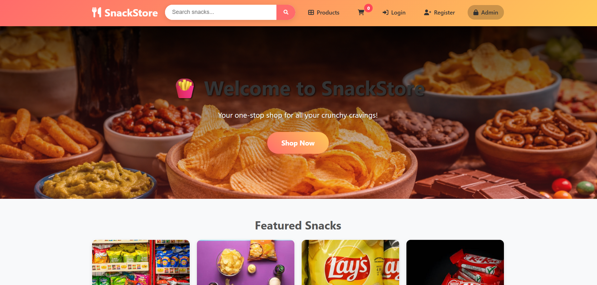
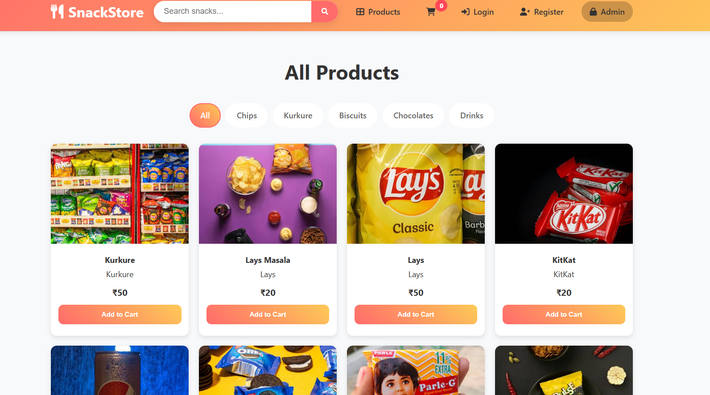
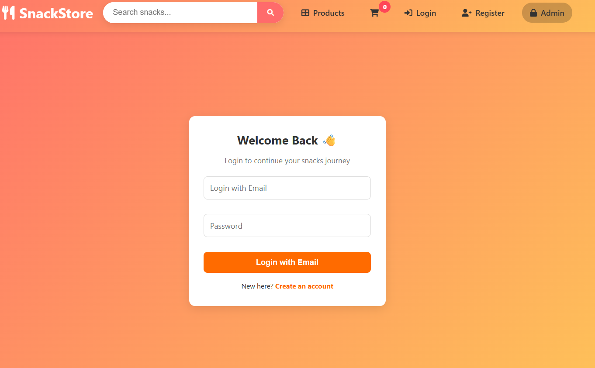
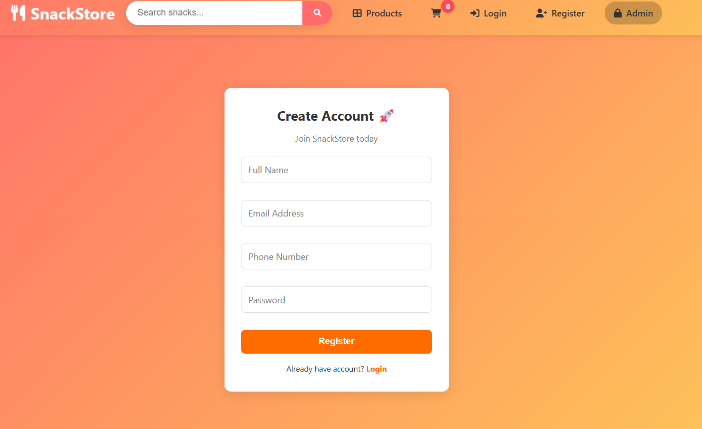
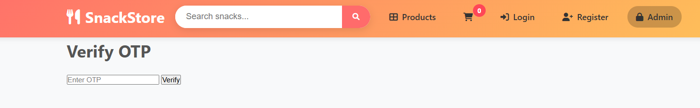
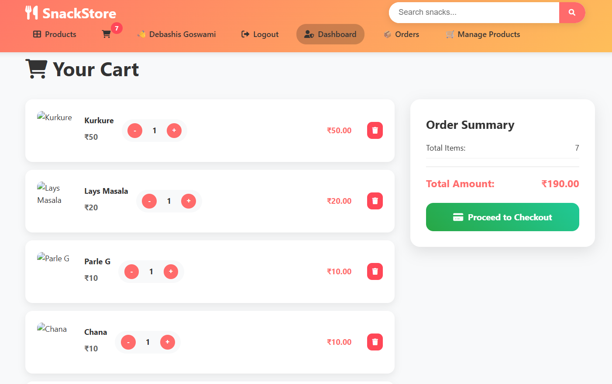
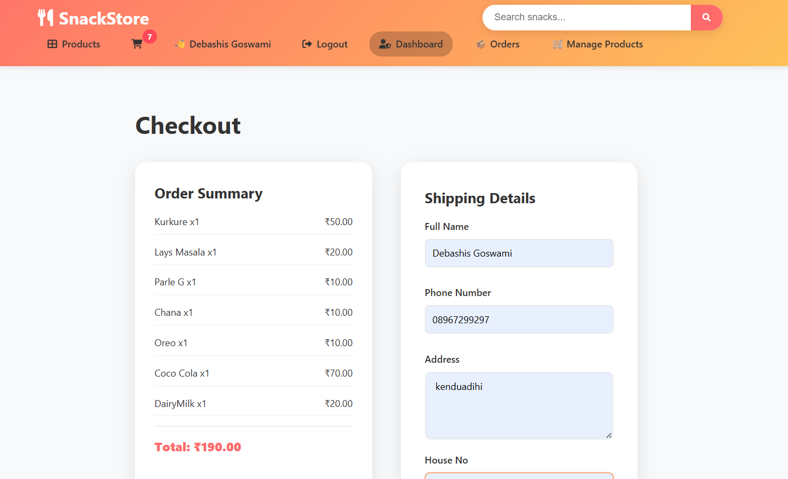
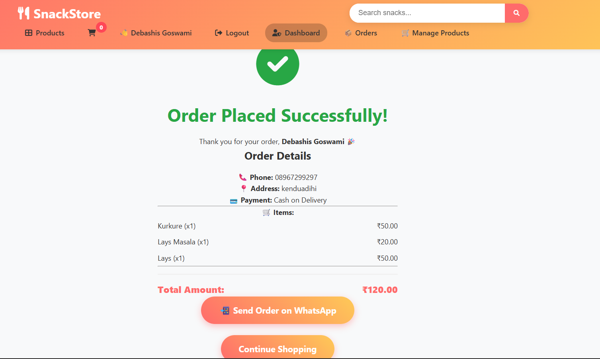
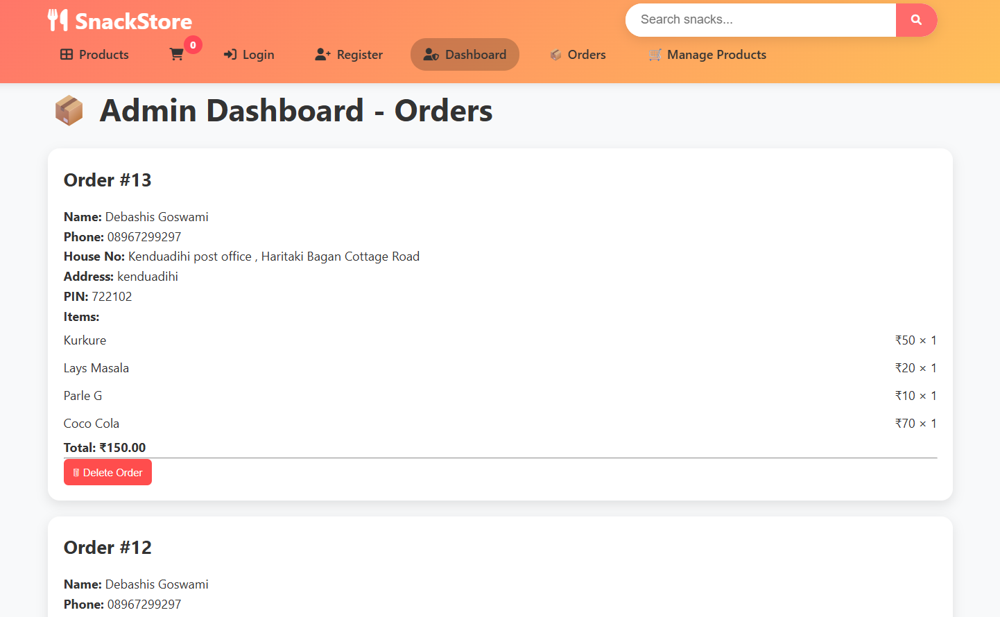
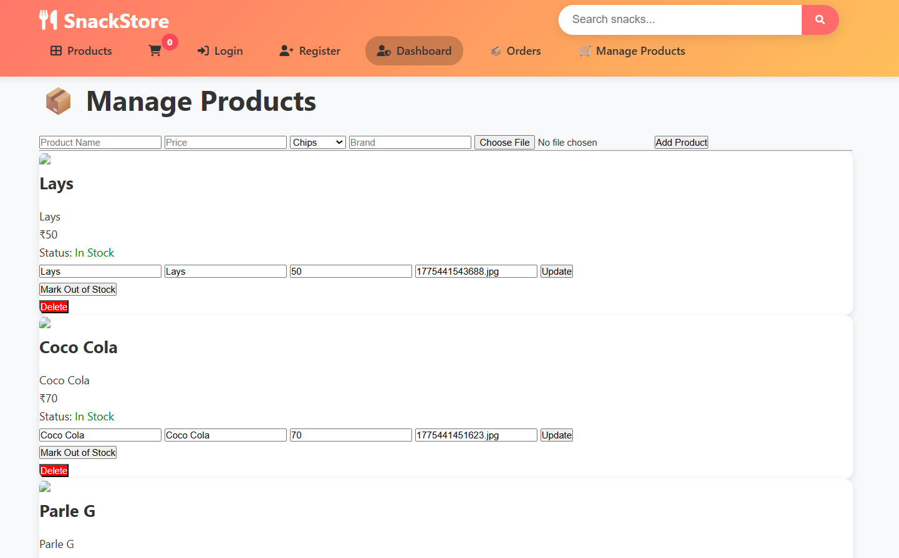

# 📸 Screenshots & Features

## 🏠 Home Page

👉 Displays featured snacks  
👉 Quick navigation to products  
👉 Clean and responsive UI  

---

## 🛍️ Products Page

👉 Shows all available products  
👉 Search functionality  
👉 Add to Cart option  

---

## 🔐 Login Page

👉 User login with email/phone  
👉 Secure authentication system  

---

## 📝 Register Page

👉 New user registration  
👉 User details input (name, email, password)  

---

## 🔑 OTP Verification Page

👉 OTP verification before login  
👉 Enhances account security  

---

## 🛒 Cart Page

👉 View added products  
👉 Update quantity  
👉 Remove items  
👉 Total price calculation  

---

## 💳 Checkout Page

👉 User enters delivery details  
👉 Order confirmation process  

---

## ✅ Checkout Success Page

👉 Order placed successfully  
👉 Confirmation message shown  

---

## 🧑‍💼 Admin Orders Panel

👉 Admin can view all orders  
👉 Delete completed orders  

---

## ⚙️ Admin Product Management

👉 Add new products  
👉 Upload product images  
👉 Edit product details  
👉 Delete products  
👉 Toggle stock (in/out)  

---
